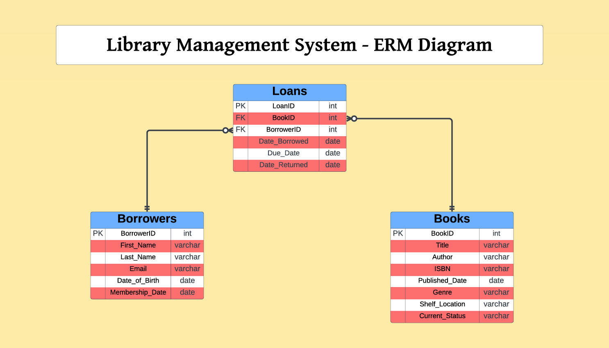

# **Library Management System**

Welcome to the Library Management System project This repository contains all the necessary components to build and manage a robust library database using MS SQL Server. The system facilitates efficient book tracking, borrower management, and loan processing.

## Project Overview

This project includes:
- **Database Schema**: Design and implementation of the database tables and relationships.
- **Stored Procedures and Functions**: Essential SQL procedures and functions for managing data and generating reports.
- **Triggers**: Automation for tracking changes in book status.
- **Bonus Features**: Advanced analytics for loan data.

## ERM Diagram

The Entity-Relationship Model (ERM) diagram provides a visual representation of the database schema, including entities, attributes, and relationships.

## Features

### For Library Staff
- **Manage Books**: Add, update, and remove book records.
- **Manage Borrowers**: Register and update borrower details.
- **Track Loans**: Record and monitor loan transactions.

### For Borrowers
- **Search Books**: Find books by title, author, genre, or ISBN.
- **View Loan History**: Access records of borrowed books and due dates.
- **Check Overdue Status**: View overdue books and calculate fees.

## Stored Procedures and Functions

- **Stored Procedures**:
  - sp_AddNewBorrower: Adds a new borrower with an email uniqueness check.
  - sp_BorrowedBooksReport: Generates a report of borrowed books within a specified date range.

- **Functions**:
  - fn_CalculateOverdueFees: Calculates overdue fees based on overdue days.
  - fn_BookBorrowingFrequency: Counts how often a book has been borrowed.

## Triggers

- **AuditLog Trigger**: Logs changes in book status between Available and Borrowed.

## Bonus Features

- **Weekly Peak Days Analysis**: Identifies the top 3 days of the week with the highest loan percentages.

